# <u>PaleoRocks: A machine learning approach to fossil identification and quantification</u>

## <u>Team Members</u>

### ESS 569:

- <b>Laura Thomas:</b> Second year AMATH Ph.D. student with expertise in numerical linear algebra and algorithms. Led model implementation and contributed immensely to coding, machine learning theory, and model evaluation.

- <b>Lucy Helms:</b> First year ESS Ph.D. student with expertise in sedimentology and paleontology. Led preparation of the training dataset and contributed immensely to project conceptualization, research question development, and preprocessing of image data.

### ESS 469:

- <b>Dahlia Gietka:</b> Fouth year ESS undergraduate with expertise in soils, geohazards, and science communication. Led literature review and motivation and contributed immensely to building training data, researching methods, and model selection.

- <b>Sophia Robillard:</b> Fourth year ESS undergraduate with expertise in isotope geochemistry and carbonate petrography. Led image preprocessing and contributed immensely to model evaluation, building training data, and visualizing results.

## <u> Introduction <u>
Throughout the geosciences, and particularly in the realm of paleontology, point counting is the standardized method for quantifying the bulk composition of a rock from a single thin section (Flügel et al. 2010, Pruss and Clemente 2011). It is a particularly powerful tool for analyzing skeletal abundance through time. However, point counting is time consuming, lacks a uniform understanding of sources of error, and can be susceptible to observer bias resulting from different experience and confidence levels. Machine learning and AI tools have the potential to resolve many of these issues, allowing for the analysis of larger datasets spanning longer periods of time.

## <u> <b> Research Question: </b> </u>
### Can we build a model that can point count as well as an expert?
Or, more specifically:
### Can our model predict if a thin section image does or does not contain a fossil?

## <u> Background & Motivation </u>
### ML in Paleontology
Machine learning approaches are particularly useful in paleontological classifications because it helps overcome some of the challenges mentioned above, such as:
- Observer bias
- Data scarcity
- Subjective interpretations
- Time constraints

Ultimately, machine learning approaches have the potential to increase paleontological classification accuracy and efficiency (Marques et al. 2025).

A review paper by Marques et al. (2025) compiled studies of machine learning in paleontological identification and classification, and found that most existing studies that leverage AI/ML in paleontological research:
- Utilize deep learning (CNN, DNN) and computer vision
- Apply ML for morphological analysis or segmentation
- Are temporally restricted to the Quaternary
- Are spatially restricted to North America and China

## Our ML Approach
With our model, we aim to build on the existing body of ML in paleontology by:
- Utilizing transfer learning with a CNN architecture
- Identify if an object is/ is not an fossil
- <b>Not</b> trying trace or outline the fossil
- Trying to develop a workflow for researchers to apply to their own thin sections, from any time, to identify and (hopefully, later) quantify the fossil composition of a sample

## <u> Model Design </u>
### <u> Inputs </u>
- Thin section images 

### Training Data
- Classified thin section images of samples from the Lower to Middle Ordovician Pogonip Group strata of the Arrow Canyon Range, Nevada
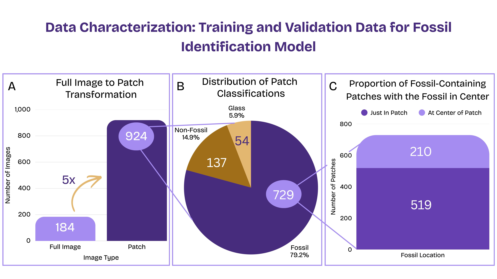
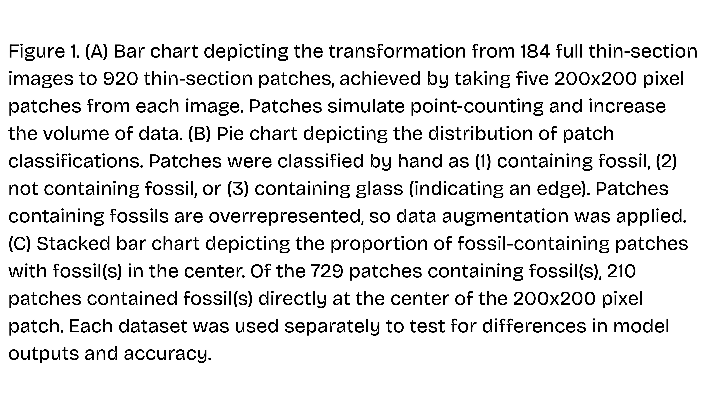

### Validation Data
- The classified patches were randomly split into 80% training and 20% validation
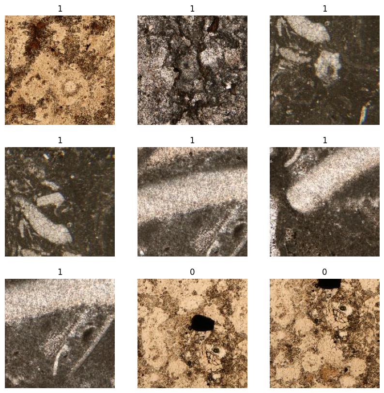

*Figure 2: Example patches generated from our data. Patches labeled "1" contain fossils, while patches labeled "0" do not contain fossils".*

### Testing Data
- Prior to splitting the patches into training or validation, one sample from each unit (Opb, Opc, Opd, Ope, and Opf) was randomly selected and all images from those samples were withheld. 
    - The model tested on the Arrow Canyon Range thin section images it had never seen before
- Carbonate thin section images were obtained from CarbonateWorld, an online database and teaching tool for carbonate petrography.
    - The model tested on patches generated from 10 different CarbonateWorld thin sections, from different lithofacies and time periods than our own dataset.
    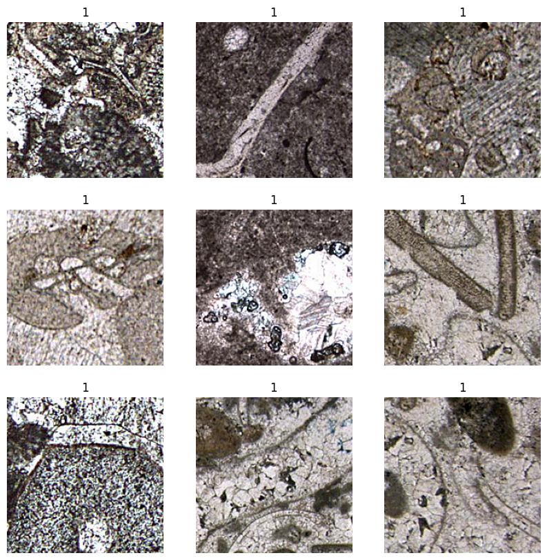

    *Figure 3: Example patches generated from CarbonateWorld thin sections. As in Figure 2, patches labeled "1" contain a fossil, while patches labeled "0" do not.*

### <u> Outputs </u>
- Classification of each patch as fossil or non-fossil
- Metric of model accuracy

## Glossary
- <b> Sample: </b> A piece of rock that represents a discrete period of time.
- <b> Thin section: </b> Part of a rock sample glued to a piece of glass and finely ground down so that light can pass through and the rock can be analyzed under a microscope.
    - The morphological and optical properties of each unique part of the thin section allow for the identification of fossil and non-fossil components, which in turn allows for the classification of the composition of the entire rock sample.
- <b> Point Counting: </b> Image-based method of identifying and quantifying the composition of a whole sample from a thin section.
- <b> Petrography: </b> Study of the classification of rocks, typically utilizing a microscope.
- <b>Geologic Unit:</b> A package of rocks characterized and/ or binned by common features. These features can be a shared period of time, similar lithologies, similar fossil contents, similar environments, etc. It is a general descriptive term for when and where your rocks come from.
    - e.g. Lucy Helms' rock samples come from units Opb, Opc, Opd, Ope, and Opf (geologic units) of the Arrow Canyon Range.
- <b> Strata: </b> The layers of rock comprising a geologic unit.
- <b> Lithofacies: </b> Each unique combination of physical characteristics that denote different rock types.

## <u> ML Approach</u>
### <u>CNN with Transfer Learning</u>
For our model, we chose to use a convolutional neural network (CNN) with *transfer learning*. Transfer learning allowed us to use a pre-constructed model architecture with pre-trained weights, which we called the **base model**. We then added our own layers to this model, which we called our **top layers**. 

We chose this type of model architecture because CNN is standard across the literature, yet transfer learning is a powerful but underutilized tool, as only about 32% of existing paleontological machine learning studies use transfer learning. (Marques et al. 2025) This type of architecture allowed us to save computational resources because we did not have to train our model from scratch. 

We used the Xception model as our base model, and it was trained on the ImageNet dataset, a dataset of millions of pre-classified images. We made these choices because they are standard in the field and promote computational efficiency (Marques et al. 2025). Other models that could be implemented and explored are VGG16, VGG19, ResNet, and EfficientNet. 

In our code, we utilized the **Keras** package in **Python**. This package has these models (and others!) built in and pre-trained on the ImageNet dataset. 

### <u>Training Two Models</u>

We trained two models in our approach. Our initial model classified based on whether or not there was a fossil anywhere within each thin section patch. To more accurately simulate point counting, we developed a second model, which classified based on whether or not there was a fossil within the exact center of each patch. We found the exact center using code that can be found in AddCenterDot.ipynb. 

### <u>Data Augmentation</u>
To promote robustness of our model and to increase the size of our training dataset, we implemented data augmentation techniques. Data augmentation is another underutilized tool in paleontological machine learning studies, with only around 32% of existing studies augmenting their data (Marques et al. 2025). 

We used a random rotation and a random flip layer. We allowed for random rotations within $\pm 90\degree$ and random horizontal and vertical flips. 

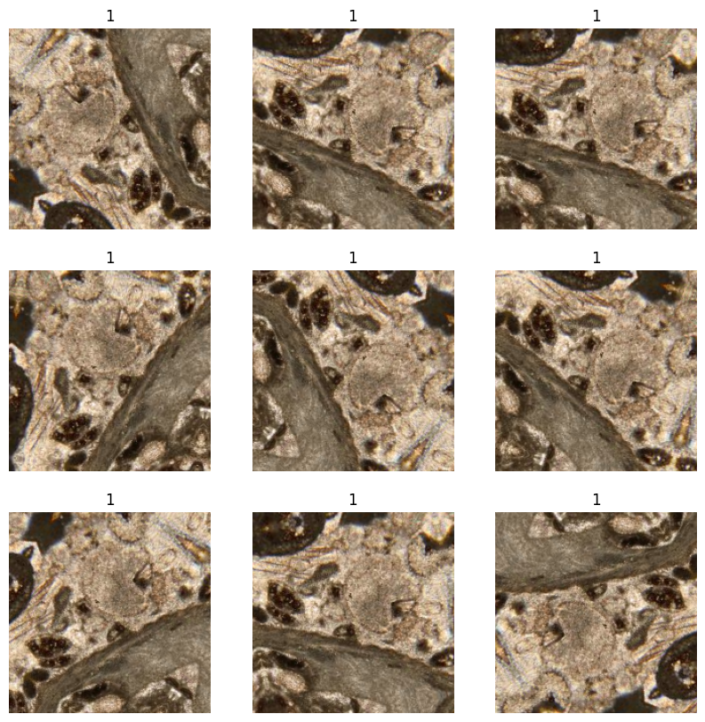

*Figure 4: Example of augmented patch data for one patch. The image was randomly flipped and rotated 9 different times.*

As shown in **Figure 1B**, data for our whole patch classification model was skewed in favor of fossil data. Due to this disparity, our initial model learned that *everything* was a fossil. To combat this issue, we focused on augmenting the *non-fossil* data in the whole patch classification model. Conversely, as shown in **Figure 1C**, data for our center patch classification model was skewed in favor of non-fossil data. Thus, in this model, we focused on augmenting our *fossil* data. It should be noted that for the center patch classification model, we only allowed our images to be randomly flipped rather than flipped and/or rotated, as rotation may have skewed the center fossil in each patch. 

### <u>Top Layers</u>
The layer structure of our model is as follows: 

**Base Model** &rarr; **Global Average Pooling Layer** &rarr; **Dropout Layer** &rarr; **Dense/Fully Connected Layer with Sigmoid Classification**

The top layers are: 

**Global Average Pooling Layer** &rarr; **Dropout Layer** &rarr; **Dense/Fully Connected Layer with Sigmoid Classification**

 This is a standard transfer learning CNN model, but top layers could be tuned based on user preferences. 

 During model training, we froze the base model so the pre-trained weights remained unchanged. During this phase of training, only the top layers were tuned. These layers were tuned using 10 total epochs. After this phase of training, the base model was unfrozen and all model weights were tuned over 3 epochs. The Adam optimizer was used throughout, though in practice this can be changed and multiple optimizers should be evaluated and compared. 

 ### <u>Tuning Hyperparameters</u>

 There were a number of hyperparameters to tune in the final model. We tuned these hyperparameters by hand, though in practice cross-validation could be implemented. The final values for each hyperparameter is given in **Table 1**. 

 | **Hyperparameter**                          | **Value**     |
|------------------------------------|-----------|
| Batch size                         | 36        |
| Number of epochs (top layer)       | 5 - 10    |
| Number of epochs (fine-tuning)     | 1 - 3     |
| Learning rate (Adam optimizer)     | 1e-5      |
| Dropout rate                       | 10%       |

*Table 1: Tuned hyperparameters in final model. Both models (whole patch and center classification) used the same hyperparameters.*

### <u>Machine Learning Workflow</u>
The final machine learning workflow for the model is as follows:

**Randomly Remove Thin Section for Testing Data**  

&darr; 

**Split Remaining Data into Training and Validation Sets**  

&darr; 

**Data Augmentation (flip and/or rotate)**

&darr; 

**Import Base Model and Weights Trained on ImageNet**  

&darr; 

**Train Top Layers**
  
&darr; 

**Fine Tune All Model Layers**  

&darr; 

**Evaluate Model on Test and Unseen Data**

This workflow is summarized in **Figure 4**. 

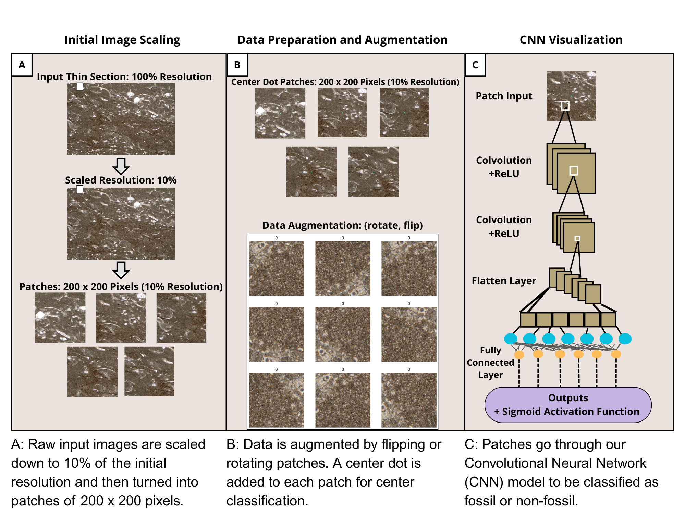

*Figure 5: A machine learning workflow for patch generation and fossil classification is summarized.*
## <u>Results</u>
Model accuracy and loss on the training and validation datasets increased and decreased, respectively, across each epoch of training. We saw a large jump in accuracy and loss once we finished training our top layers and began tuning the entire model. 

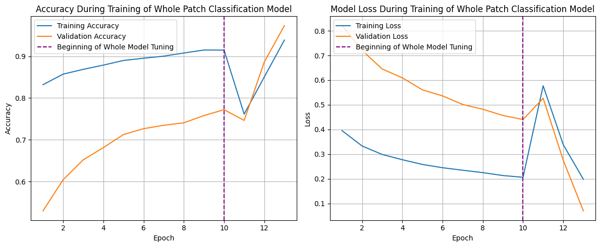
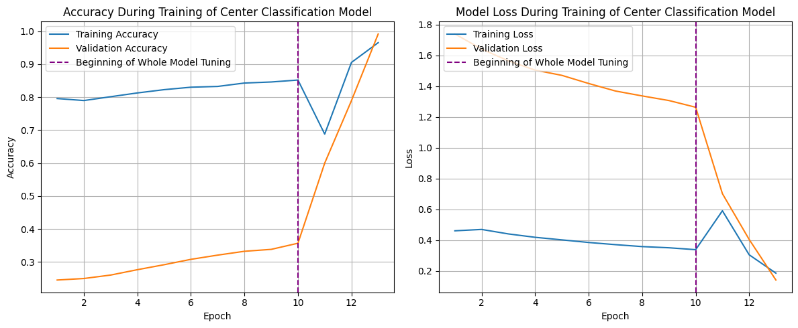

*Figure 6: Loss and accuracy plots for the whole patch (upper) and center patch (lower) classification models.*

The final models in both cases do quite well at classifying the training and validation sets, with accuracy well over 90% in each case. In our final models, we were also able to overcome the tendency of the model to classify almost everything as having a fossil. 

Other metrics of performance that we evaluated included the following: 
| **Metric**        | **Definition and When to Use**                                      | **Mathematical Formula and Approximate Target Value**|
|--------------|------------------------------------------------|------------------------------------------------------|
| **Precision**     | True positives out of total predicted positives, useful when high risk (or high cost) of false positives, gives measure of accuracy of positive predictions | $$ pr = \frac{TP}{TP+FP} \approx 1$$ |
| **Recall (Sensitivity)** | True positives out of total actual positives, useful when high risk (or high cost) of false negatives, gives measure of how many actual positives found | $$ re = TPR = \frac{TP}{TP+FN}\approx 1 $$ |
| **Specificity**   | True negatives out of total actual negatives, measure of how well we correctly predict negative values  | $$ sp = TNR = \frac{TN}{TN + FP} \approx 1$$ |
| **AUC**           | Area under ROC curve; plots true positive vs. false positive, probability that model ranks a random positive (fossil) higher than a random negative (non-fossil) | |

*Table 2: Accuracy metrics. Note that TP is true positives, FP is false positives, TN is true negatives, and FN is false negatives. Also note that the metric we used in our model evaluation for specificity was **specificity at sensitivity**, which gives the highest achieved specificity for a pre-determined sensitivity rate, which we set at 90%.*

Due to the tendency of our model to incorrectly classify negative (non-fossil) values, we paid particular attention to binary accuracy and specificity. We categorized metrics according to literature standard values using the following classification system: 

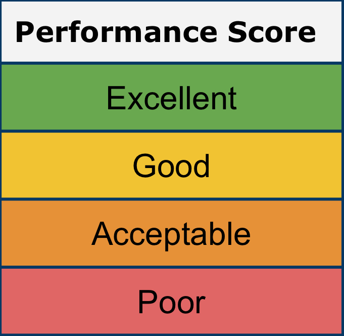

*Figure 7: Model performance scoring chart*

With our tuned hyperparameters, we were able to achieve good performance values for the whole patch model on the test dataset, though the model performed relatively poorly on the unseen data from CarbonateWorld. 

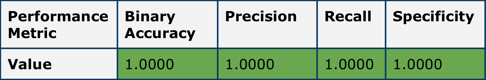

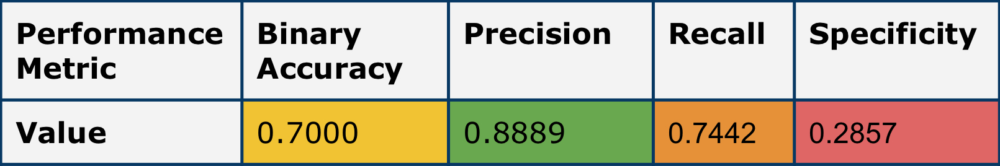

*Figure 8: Whole patch classification model performance, with metrics color coded according to the chart given in **Figure 6**. We see that the model does quite well on the testing data set from our thin section data (upper chart) and worse on the unseen test data from CarbonateWorld (lower).*

The center patch classification model generally did not perform quite as well as the whole patch classification model. As with the whole patch classification model, the center classification model did well on our thin sections and poorly on the unseen test data. 

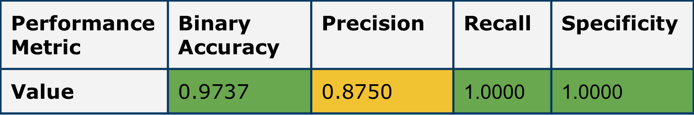

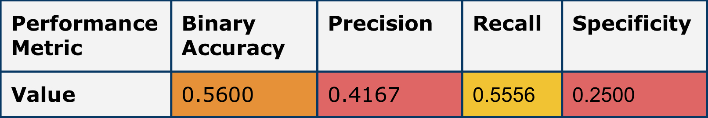

*Figure 9: Center patch classification model performance, with metrics color coded according to the chart given in **Figure 6**. We see that the model does quite well on the testing data set from our thin section data (upper chart) and worse on the unseen test data from CarbonateWorld (lower).*

Finally, we evaluated ROC curves to see how well our models compare to each other and to a random model. 

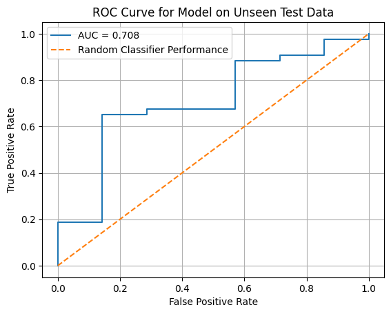

*Figure 10: ROC curves for whole patch classification model. We see that the model does quite well on our isolated test thin sections (left) and worse but still better than a random model on the unseen data (right).*

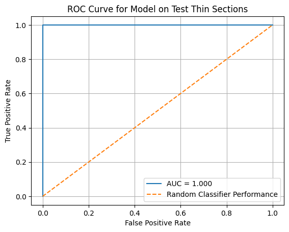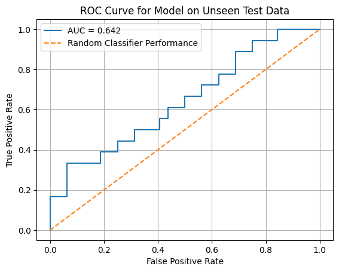

*Figure 11: ROC curves for center patch classification model. We see that the model does quite well on our isolated test thin sections (left) and worse but still better than a random model on the unseen data (right).*

## <u>Discussion</u>

Overall, we found that both models performed quite well on our thin sections. The whole patch classification model slightly outperformed the center patch classification model. Although both models performed strongly on the test dataset, their performance dropped on the unseen dataset from CarbonateWorld. We argue that this drop in performance is not an issue for our purposes. Our goal is to learn to classify thin sections from a particular lab's data, where sections come from the same place and similar time periods. We demonstrated that this approach can learn to classify fossil vs. non-fossil data quite well on thin sections from a particular spatial and temporal area. While this model is not perfectly generalizable, as demonsrated by the relatively poor performance on the unseen data, the model is able to perform quite well for its intended use. This conclusion is backed up by the strong performance metrics across the test data set. No matter which thin sections we held back for testing, we were able to achieve similar results with each model (develop a figure for this...?).

## <u>Future Work</u>

There are many future directions for this work. In particular, we hope to develop this project into a robust machine learning workflow to publish, along with accompanying code that labs could implement in their classification problems. In order to develop this workflow, a few key steps need to be taken, including: 

- **Quantifying abundances**: Can we use our model to identify how many fossils are within a thin section (as in point counting) and develop clean code to do this? 
- **Fossil Recognition**: Can we get our model to recognize specific fossils on the phylum level? This will require a multi-class implementation, rather than the binary class models shown above. 
- **Model Tuning**: The model can be made more robust in a number of ways. Namely, we can implement cross validation, tune the top layers of the model, and compare multiple base models and optimizer choices, as this type of analysis is lacking in the paleontology machine learning literature. 

## References
- Flügel, E., 2010, Microfacies of Carbonate Rocks: Springer, Berlin, Heidelberg. http://link.springer.com/10.1007/978-3-662-08726-8.

- Marques, C.S., Malafaia, E., Pereira, S., Santos, V.F., and Dufourq, E., 2025, A review of machine learning applications for identification and classification problems in paleontology: Ecological Informatics, v. 91, p. 103329, doi:10.1016/j.ecoinf.2025.103329.

- Pruss, S.B., and Clemente, H., 2011, Assessing the Role of Skeletons in Early Paleozoic Carbonate Production: Insights from Cambro-Ordovician Strata, Western Newfoundland, in Laflamme, M., Schiffbauer, J.D., and Dornbos, S.Q., eds., Quantifying the Evolution of Early Life: Numerical Approaches to the Evaluation of Fossils and Ancient Ecosystems: Springer Netherlands, Dordrecht, p. 161–183. https://doi.org/10.1007/978-94-007-0680-4_7.